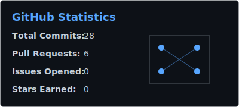

  

<h1 align="center">Hi there, I'm Amit Pal! 👋</h1>
<h3 align="center">CS Student & IoT Enthusiast 🚀</h3>

  I'm a passionate Computer Science student with a deep interest in the Internet of Things (IoT). 
  I love building smart devices, exploring embedded systems, and writing efficient code.

  
  ---
  
  ### 🛠️ Tech Stack
  
  
  
  
  
  
  

  ---

  <h3>📊 GitHub Statistics</h3>
  

    <em>These stats are automatically generated daily by a GitHub Action in this repo!</em>
  

  

  
  ---
  
  <h3>📫 Connect with Me</h3>
  
  
  
  

